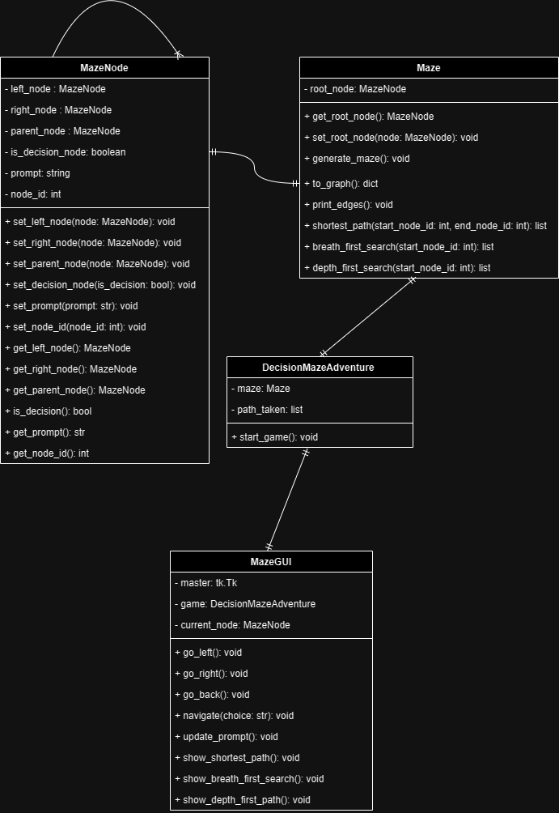

# Decision-Making Maze

## Project Goals
The primary aim of Decision-Making Maze is to create a simple text-based adventure game. In this application a maze structure was implemented using tree data structure, where each node represents a decision point. The user navigates through the maze by choosing either left or right at each node, ultimately reaching either a "good end" or a "bad end". It should serve as a foundation for users to craft their own Choose Your Own Adventure-style games.
## Significance of the Project
There isn’t really a huge ambition in this small and simple application that is developed in a relatively short period of time. It is not expect to be something that can lead to a decrease in crime rate, nor is it expect to be something that people will enjoy playing hours on end. It is only hoped that who ever came across this application will be encouraged to embark on a short journey to create their own simple applications or games, that might contribute to the well-being and happiness of others. Plus, my teammate and I, had a fantastic period of time bringing a rough and vague idea to life. It really sparked an immense amount of joy and happiness in both of us, when a function finally worked after when spending hours trying to figure out what went wrong.
## Installation and Usage Instructions
### Recommended Software
- GitHub Desktop
- PyCharm
- Python 3.10

### Installation
1. Ensure Python 3.10 is installed.
2. Clone the repository.
   - Clone the repository and Run py
        ```sh
        git clone https://github.com/Xingyu-Jiang/Decision-Maze-Adventure.git
        cd decision-maze-adventure
3. Install necessary libraries (such as tkinter if not available).
4. Run the Python script MazeGUI.py.
5. Follow the GUI instructions to interact with the prebuilt maze sample.

### Usage
- Launch the application to open the graphical interface.
- Confirm tkinter installation if the interface doesn't appear.
- Verify that DecisionMazeAdventure.py and MazeGUI.py are in the same directory.
- Use the provided buttons ("<-- Left", " - Back -", " Right -->") to navigate the maze.
- Access additional functionalities like finding the shortest path, BFS, and DFS via corresponding buttons.

## Code Structure
### UML Diagram


### Explanations
- `MazeNode`: Represents nodes in the maze.
- `Maze`: Generates and operates on the maze structure.
- `DecisionMazeAdventure`: Manages game aspects.
- `MazeGUI`: Creates the graphical interface for maze navigation.

## Functionalities and Test Results
### Functionalities
#### MazeNode Class
- Methods for setting and getting node attributes.
- Left node, right node, parent node.
- Identification of decision nodes.
- Node prompt and ID.

#### Maze Class
- Printing edges of the maze.
- Maze generation methods.
- Conversion of maze from tree to graph data structure.
- Maze traversal (shortest path, BFS, DFS).
- Printing edges of the maze.

#### DecisionMazeAdventure Class
- Initialization of a game instance using the Maze class.
- Recording the path taken in the game.

#### MazeGUI
- Methods for setting up tkinter GUI elements.
- Methods for GUI interactions (navigating the maze, displaying paths).

## Discussion and Conclusions
Our application faced two key issues that we aimed to address given more time. Firstly, the current maze creation process is very tedious, requiring manual creation of each node, resulting in significant time and mental strain. We're exploring a solution by developing a function to parse maze data from a CSV file, streamlining the node creation process. So that the player can have multiple maze ready to be load and interact with. Secondly, the maze feels somewhat empty for the player due to limited engaging functionalities. We aspire to introduce systems that enhance interactivity, such as a point-based system that replaces basic directional choices with engaging questions, requiring users to pick the correct answer from options. Additionally, our goal is to craft more complex mazes. Instead of repetitive navigation to locate the node with a positive outcome, we aim to establish a specific path that users must follow to traverse the entire maze and reach its the proper ending. We also hope to implementing a 2D graphical user interface for a more visual and immersive experience, as text-based game might have a very small audience.

During the development of this application we mainly applied the knowledge we gathered during the development of other assignment. Some of the more obvious application are the graph traversal algorithms breath-first search and depth-first search, which are also applied in finding the shortest path. We tried to implement Prim's algorithm and Kruskal algorithm, however we didn’t find a need for finding a minimal spanning tree in a maze application, so we didn’t include them. Most importantly, we chose to use a tree data structure for the maze mainly because we realized that, similar to how a graph can be represented as an array of linked lists, something with similarities to a linked list could also be utilized.
